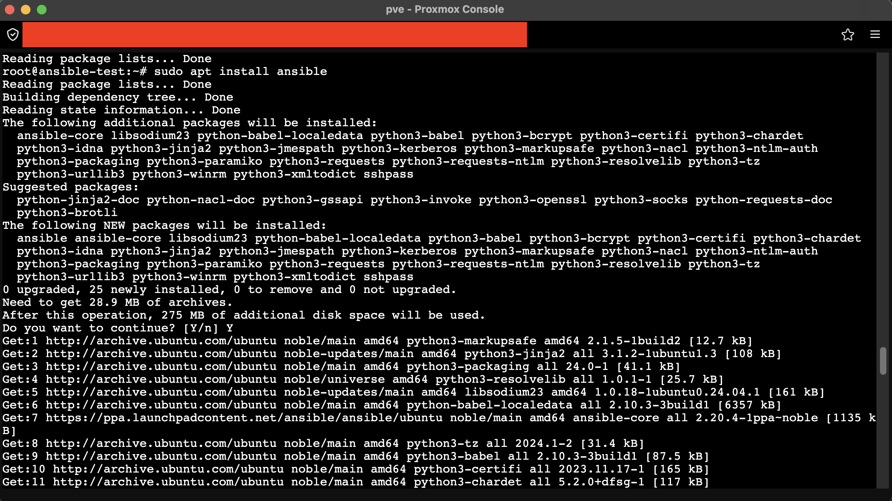
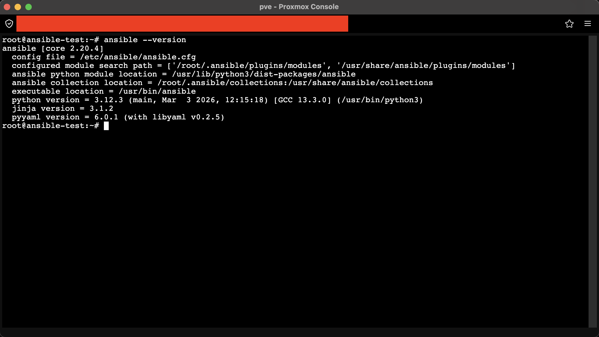
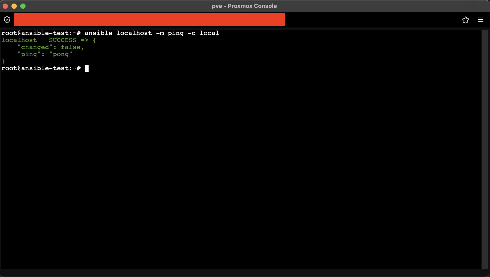

# Задание 1. Установка Ansible и запуск ad-hoc команды

## 1. Установка Ansible на окружении Ubuntu

Для выполнения задания было развернуто окружение на базе LXC-контейнера со следующими характеристиками:
- **CPU:** 1 ядро
- **RAM:** 512 МБ
- **Disk:** 5 ГБ

Перед установкой выполнено обновление репозиториев и системы:
```bash
sudo apt update
sudo apt upgrade
```

Установка Ansible произведена через официальный PPA-репозиторий для обеспечения актуальной версии:
```bash
sudo apt install software-properties-common
sudo add-apt-repository --yes --update ppa:ansible/ansible
sudo apt install ansible
```

### Скриншот процесса установки




> **Пункт 1:** Установка Ansible на Ubuntu через PPA-репозиторий. Проверка версии (`ansible --version`) подтверждает успешную установку.
---

## 2. Проверка работоспособности (Ad-hoc команда)

Так как SSH-ключи еще не настроены, для проверки работоспособности «чистой» установки Ansible использован метод локального подключения (`-c local`). Это позволяет убедиться, что управляющая машина (Control Node) корректно исполняет модули без необходимости сетевого взаимодействия.

Выполненная команда:
```bash
ansible localhost -m ping -c local
```

### Скриншот выполнения команды


> **Пункт 2:** Успешное выполнение ad-hoc команды `ping` к локальному хосту. Статус `SUCCESS` и ответ `"ping": "pong"` подтверждают, что Ansible готов к работе.

---

## Конечный результат

- ✅ **Ansible установлен** на локальной машине (LXC-контейнер Ubuntu).
- ✅ **Работоспособность подтверждена:** Успешное выполнение ad-hoc команды демонстрирует, что управляющая машина может взаимодействовать с хостом (в данном случае с самим собой через локальный коннектор).