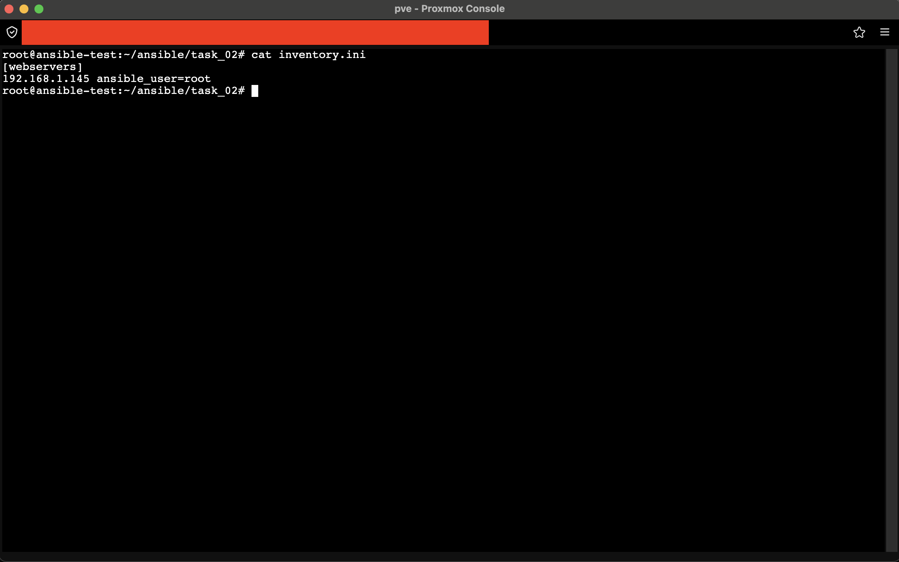
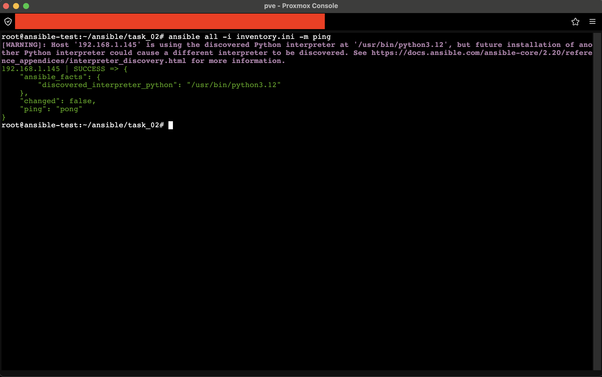
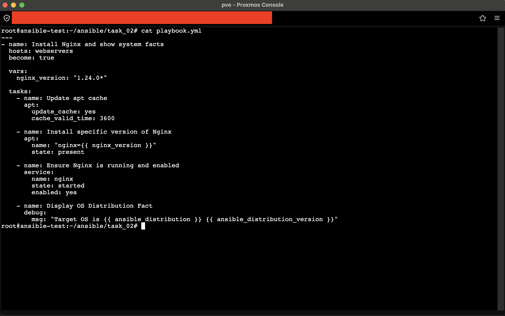
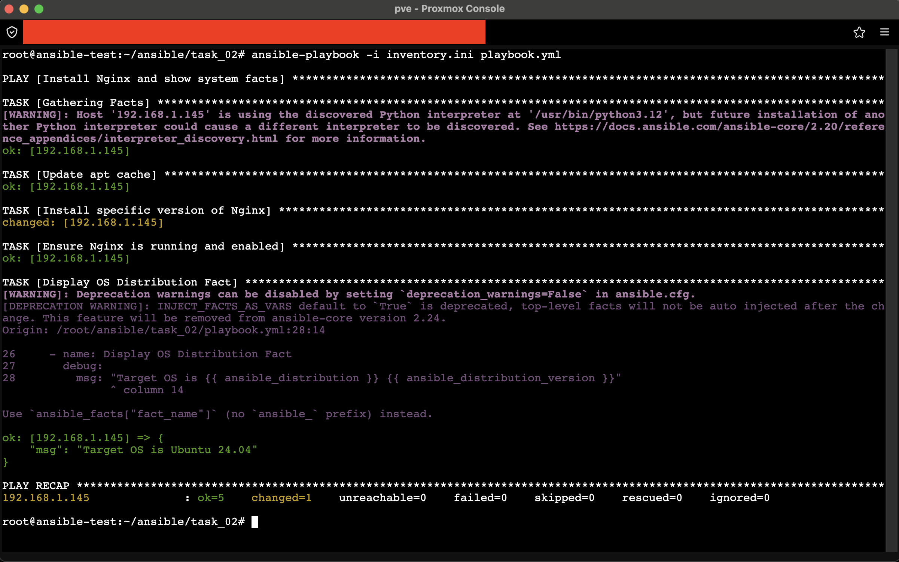
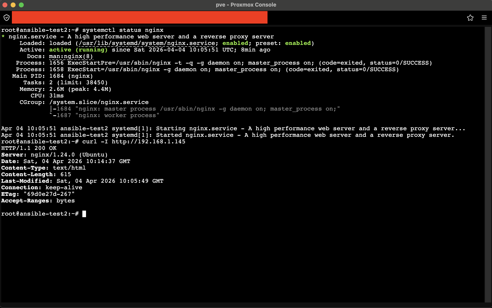
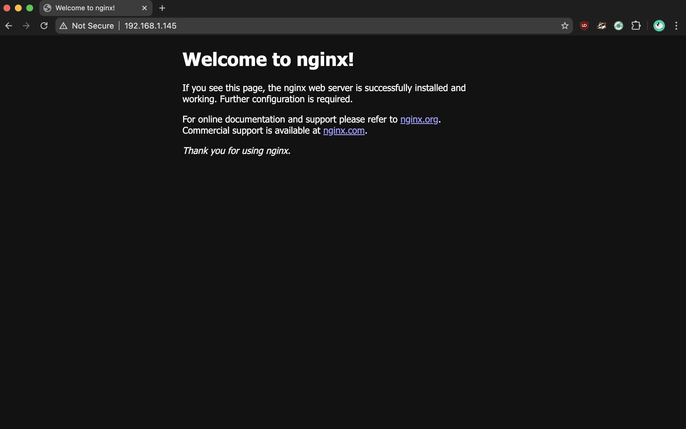

# Задание 2. Установка пакета, запуск службы и вывод системного факта

## 1. Подготовка окружения и Инвентори

Развернут второй LXC-контейнер (Target Host) с установленным SSH-сервером и настроенными ключами доступа.
На управляющей машине создан файл инвентори `inventory.ini`.

> **Пункт 1:** Файл инвентори с указанием целевого хоста.

> **Пункт 1:** Успешная проверка подключения через модуль ping.

---

## 2. Создание и запуск Playbook

Создан файл `playbook.yml` с переменной версии пакета и задачами установки, запуска и вывода фактов.

> **Пункт 2:** Исходный код Playbook.

> **Пункт 2:** Вывод выполнения плейбука. Видно успешное применение задач и сообщение с системным фактом (`Target OS is...`).

---

## 3. Проверка результата

Проверка выполнена комплексно: статус службы и сетевой доступ подтверждены в терминале, работа контента — визуально в браузере.

### 3.1. Системный и сетевой уровень (Терминал)
На скриншоте ниже представлена одновременная проверка статуса службы и HTTP-заголовков:
- Команда `systemctl status nginx` подтверждает, что служба активна (`active (running)`) и включена в автозагрузку (`enabled`).
- Команда `curl -I http://192.168.1.145` подтверждает, что сервер слушает порт 80 и возвращает статус `200 OK`.

> **Пункт 3:** Комплексная проверка в терминале. Служба работает, порт открыт, HTTP-ответ корректен.

### 3.2. Прикладной уровень (Браузер)
Визуальное подтверждение отдачи статического контента конечному пользователю.

> **Пункт 3:** Страница «Welcome to nginx!» в браузере. Сервер успешно обрабатывает GET-запросы и отдает контент.

---

## Конечный результат
- ✅ **Служба:** Запущена и включена в автозагрузку.
- ✅ **Сеть:** Порт 80 открыт, HTTP-ответ 200 OK.
- ✅ **Контент:** Веб-страница успешно отображается в браузере.
- ✅ **Системные факты:** Playbook успешно вывел информацию о дистрибутиве в процессе выполнения.