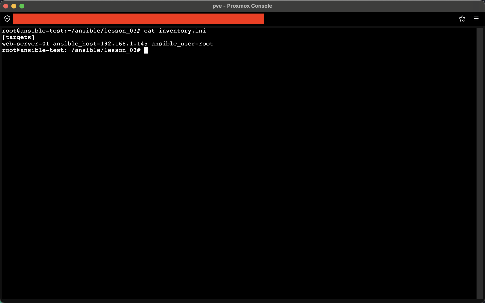
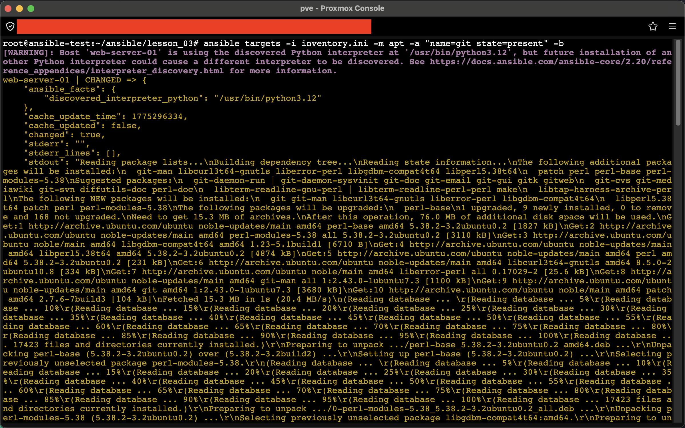

# Задание 1. Выполнить ad-hoc команду для проверки пакета

## 1. Подготовка окружения
Создан файл инвентари `inventory.ini` с группой `targets`, включающей целевой хост `web-server-01` (192.168.1.145).


> **Пункт 1:** Содержимое файла `inventory.ini` с описанием целевого хоста.

## 2. Выполнение ad-hoc команды
Использован модуль `apt` для проверки/установки пакета `git` на удаленном хосте.

**Команда:**
```bash
ansible targets -i inventory.ini -m apt -a "name=git state=present" -b
```


> **Пункт 2-3:** Результат выполнения ad-hoc команды. Ansible успешно подключился к хосту и установил пакет (статус `CHANGED`). Вывод содержит подробную информацию об установленных зависимостях.

## Итог
Пакет `git` проверен и установлен на удаленном хосте с использованием группы из инвентари.