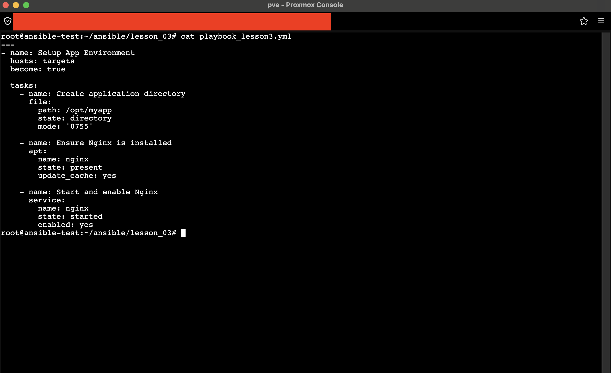
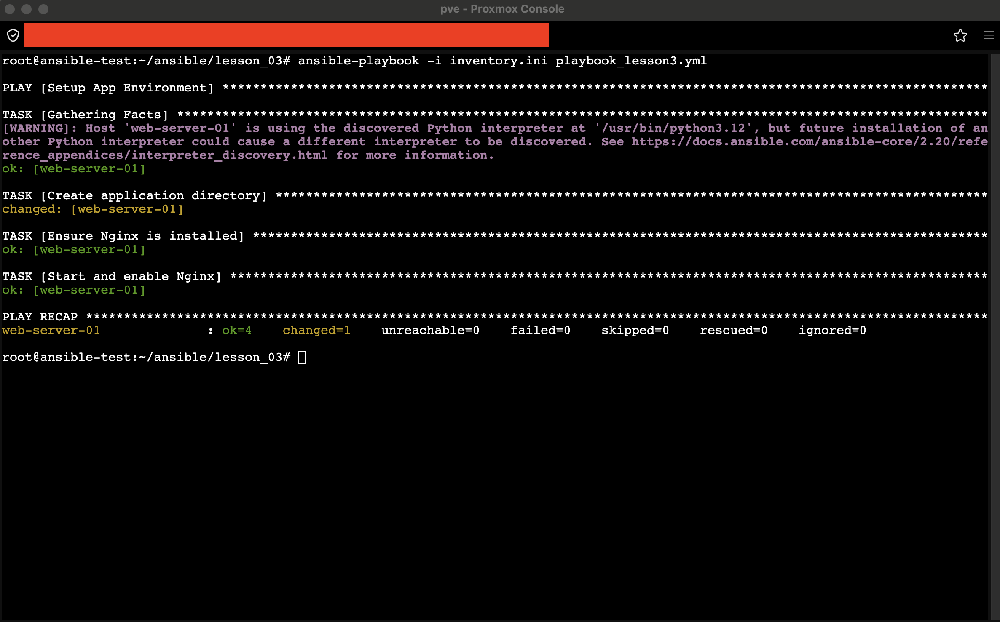
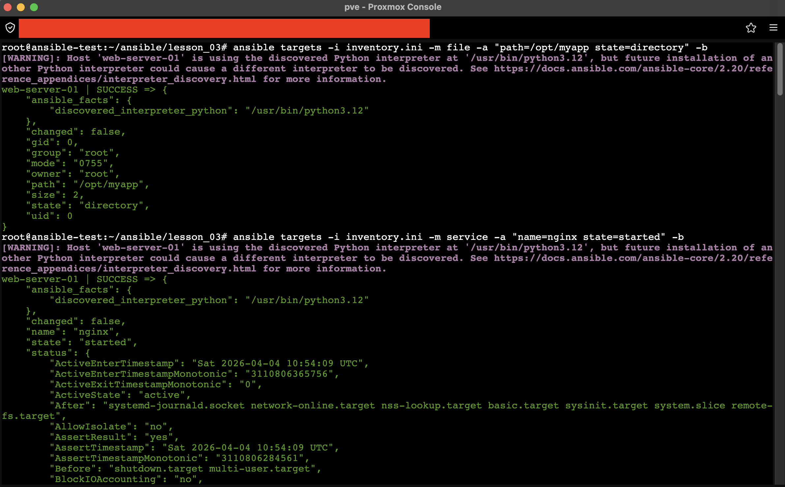

# Задание 2. Написать playbook с несколькими популярными модулями

## 1. Описание задачи
Создан плейбук `playbook_lesson3.yml`, нацеленный на группу хостов `targets`.
Задачи плейбука:
1. Создание директории `/opt/myapp`.
2. Установка веб-сервера `nginx`.
3. Запуск службы и включение в автозагрузку.

## 2. Код плейбука
```bash
cat playbook_lesson3.yml
```

> **Пункт 2:** Исходный код плейбука с использованием модулей `file`, `apt` и `service`.

## 3. Результат выполнения
Запуск плейбука выполнен с явным указанием инвентари.


> **Пункт 2:** Успешное выполнение всех задач плейбука на удаленном хосте. Статус `changed=1` указывает на внесение изменений в систему.

## 4. Проверка результата
Проведена проверка созданных ресурсов на целевом хосте с помощью ad-hoc команд.


> **Пункт 3:** 
> - Модуль `file`: Директория `/opt/myapp` существует с правами `0755`.
> - Модуль `service`: Служба `nginx` активна (`active`) и запущена (`started`).

## Итог
Все задачи выполнены успешно: директория создана, пакет установлен, сервис настроен.