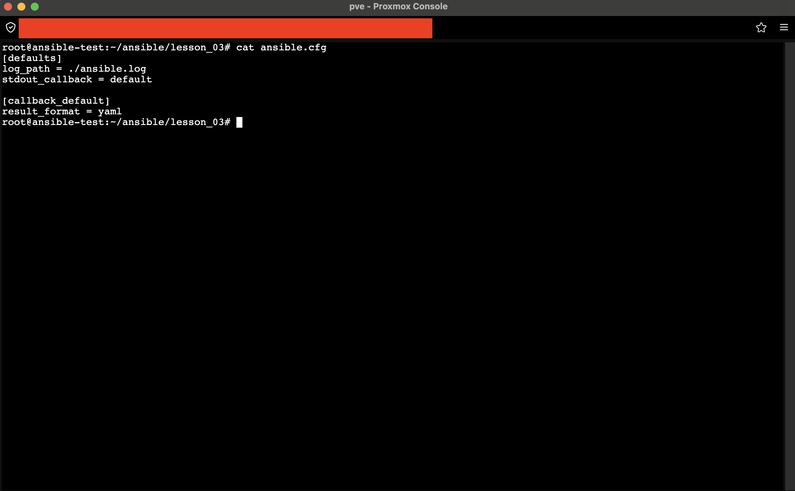
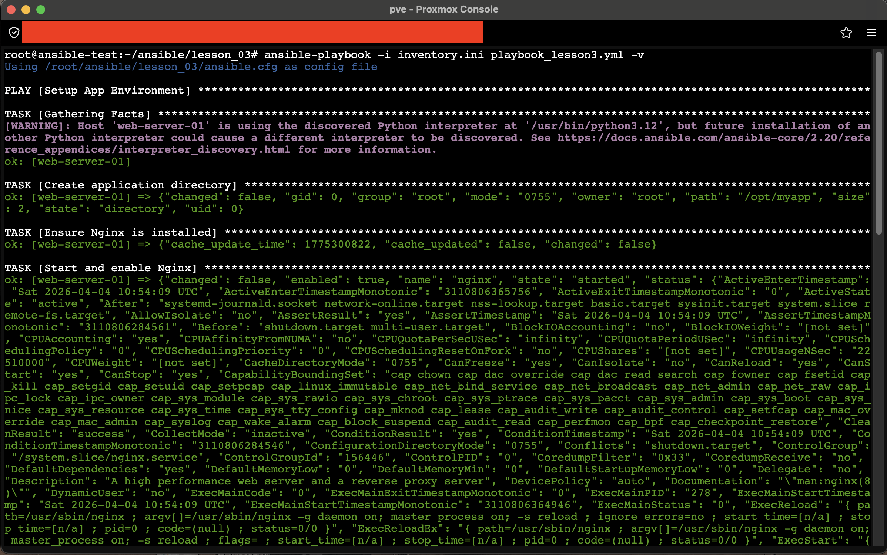
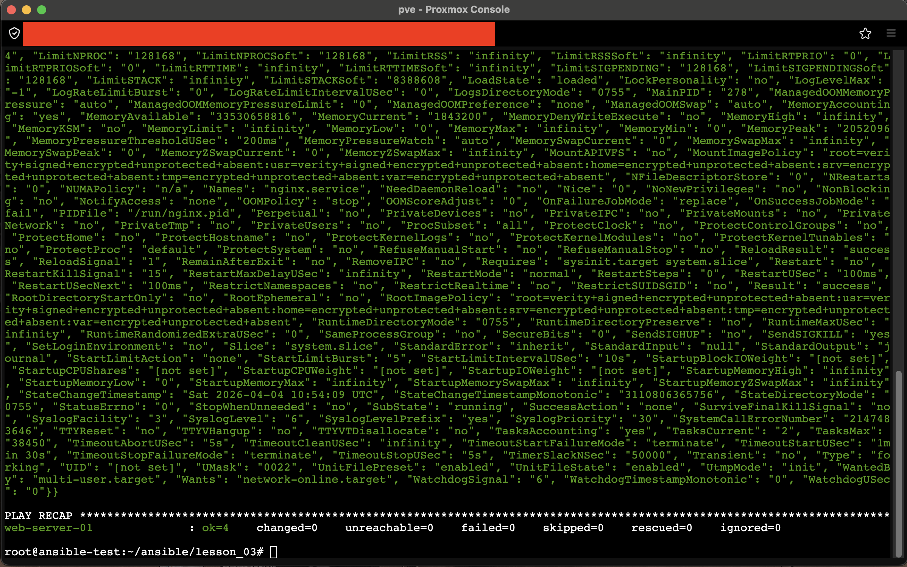
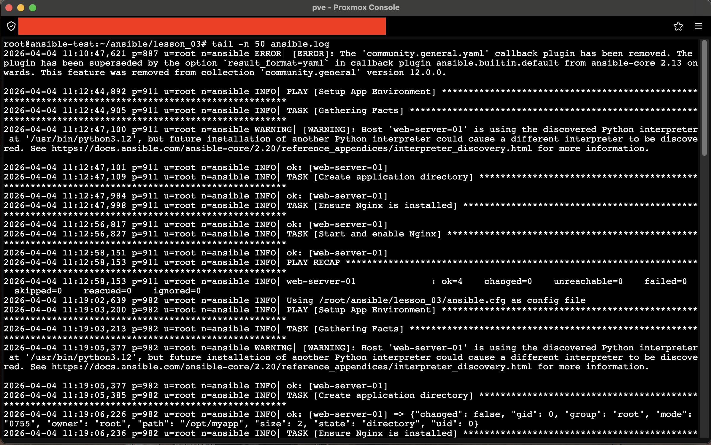

# Задание 3. Настроить более подробный вывод логов с помощью callback-плагина

## 1. Настройка конфигурации
Создан файл `ansible.cfg` в корне урока для настройки вывода и логирования.

**Содержимое `ansible.cfg`:**
```bash
cat ansible.cfg
```

> **Пункт 2:** Настройка callback-плагина `default` с опцией `result_format = yaml` и пути к лог-файлу `log_path = ./ansible.log`.

## 2. Тестирование подробного вывода
Плейбук из предыдущего задания запущен повторно с флагом `-v` (verbose) для активации детального формата вывода.

**Команда:**
```bash
ansible-playbook -i inventory.ini playbook_lesson3.yml -v
```




> **Пункт 3:** Детализированный вывод выполнения задач в структурированном формате (JSON/YAML). Видны все параметры модулей, такие как права доступа, владелец, статус службы и её свойства.

## 3. Анализ лог-файла
Все действия автоматически записываются в файл `ansible.log`.

**Просмотр лога:**
```bash
tail -n 50 ansible.log
```

> **Пункт 3:** Фрагмент файла `ansible.log` с временными метками, содержащий полную историю выполнения задач, предупреждения и итоги запуска.

## Итог
Настроен подробный вывод через callback-плагин и автоматическое логирование в файл, что упрощает отладку и аудит запусков Ansible.