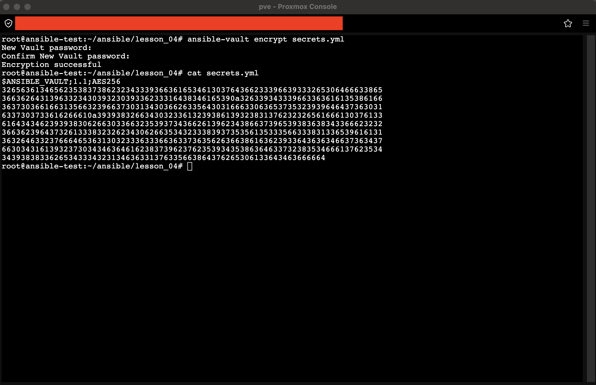
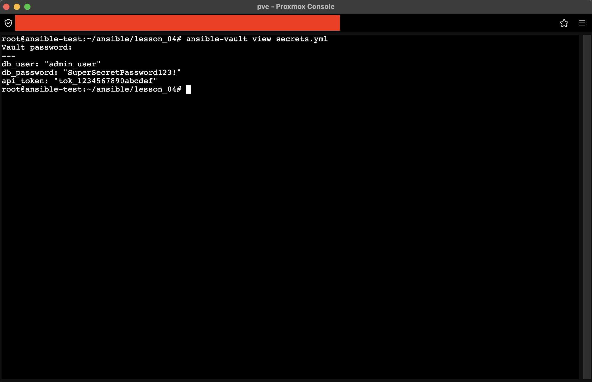
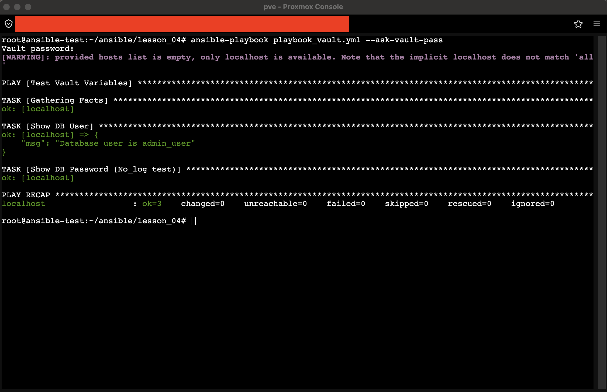
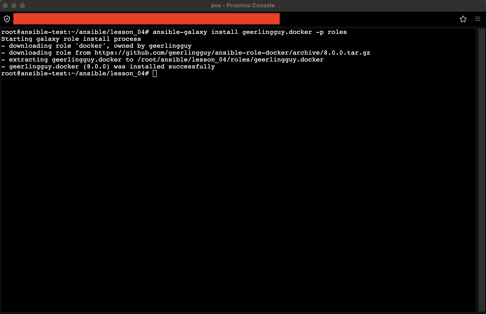
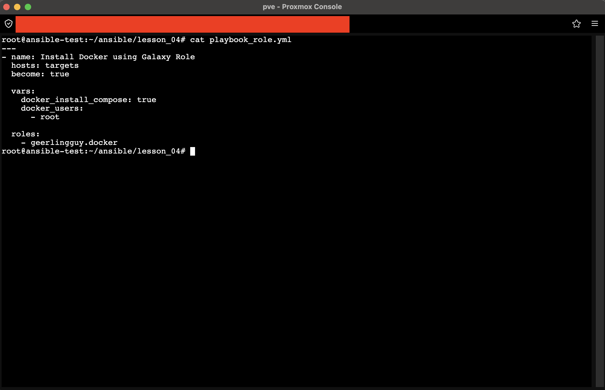
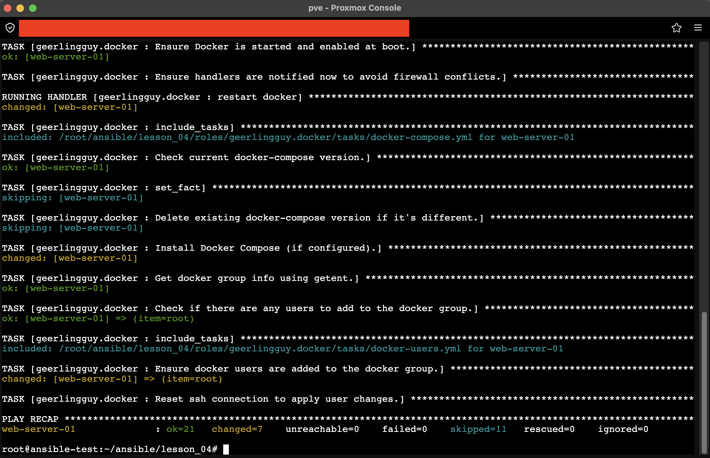
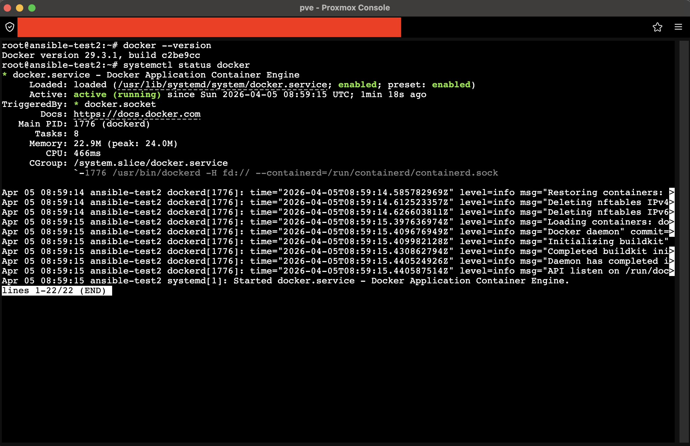

# Шифрование секретных переменных (Ansible Vault)

## 1. Создание и шифрование файла
Создан файл `secrets.yml` с тестовыми данными (логины, пароли). Зашифрован командой `ansible-vault encrypt`.

> **Пункт 3:** Содержимое файла после шифрования. Данные представлены в виде зашифрованного блока AES256.

## 2. Проверка доступа
Просмотр содержимого без сохранения открытой версии на диск через `ansible-vault view`.

> **Пункт 3:** Успешная расшифровка и просмотр переменных после ввода пароля.

## 3. Использование в плейбуке
Создан плейбук `playbook_vault.yml`, подключающий зашифрованный файл через `vars_files`. Запуск выполнен с флагом `--ask-vault-pass`.

> **Пункт 4:** Плейбук успешно получает переменные. Чувствительные данные защищены параметром `no_log` и не утекают в вывод.

## Итог
Секретные переменные надежно зашифрованы и безопасно используются в автоматизации.

# Использование роли из Ansible Galaxy

## 1. Выбор и установка роли
Выбрана роль `geerlingguy.docker` для автоматической установки Docker. Установка выполнена в локальную папку `roles`.

> **Пункт 6:** Успешная загрузка роли из Ansible Galaxy в директорию проекта.

## 2. Настройка и запуск
Создан плейбук `playbook_role.yml`, подключающий роль и переопределяющий переменные (`docker_install_compose`, `docker_users`).

> **Пункт 7-8:** Конфигурация плейбука с подключением внешней роли и кастомизацией через переменные.

> **Пункт 7:** Процесс отработки роли. Все задачи выполнены успешно.

## 3. Проверка результата
Проверка установленПО на целевом хосте.

> **Пункт 7:** Docker установлен, версия определена, сервис активен.

## Итог
Роль из Ansible Galaxy успешно интегрирована, настроена и развернута, обеспечив автоматическую установку сложного ПО.