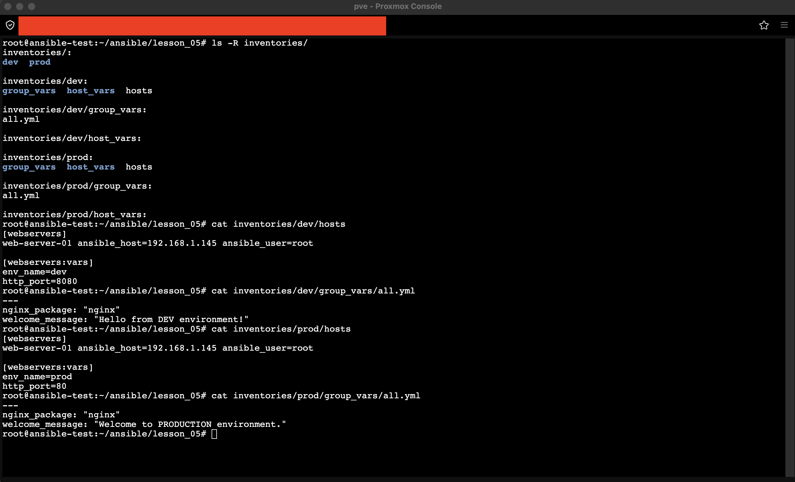
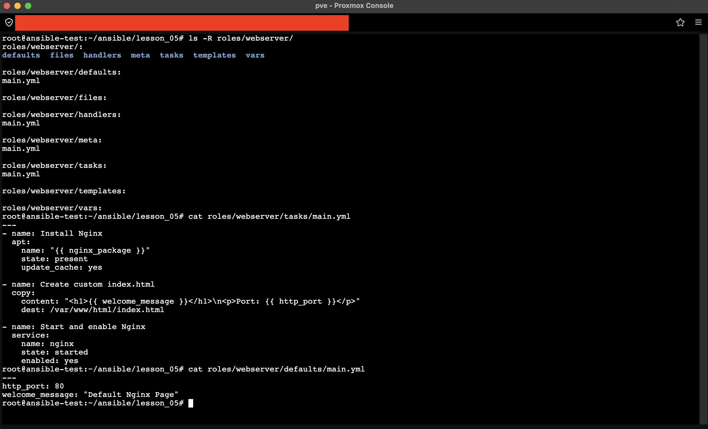
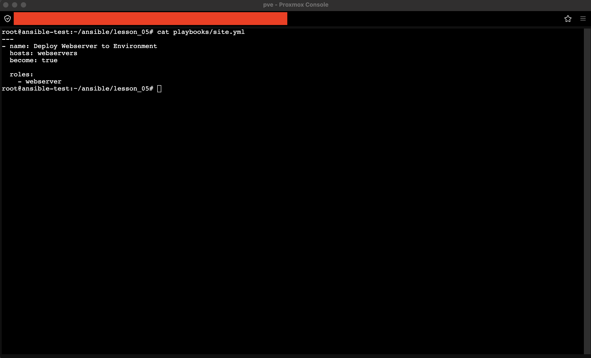
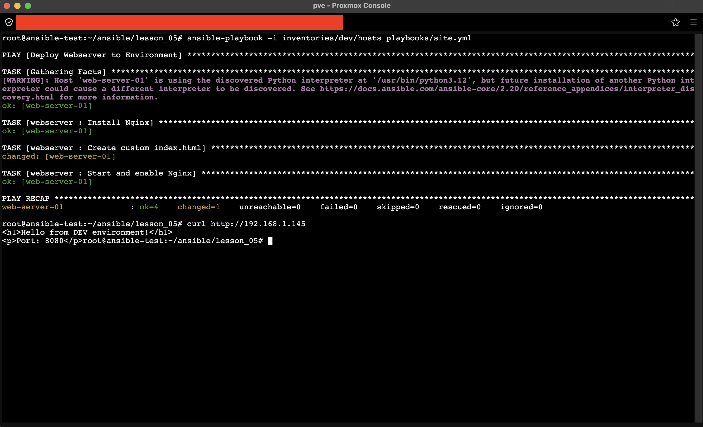
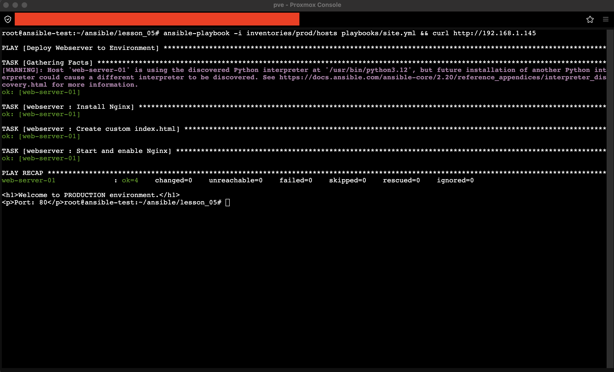
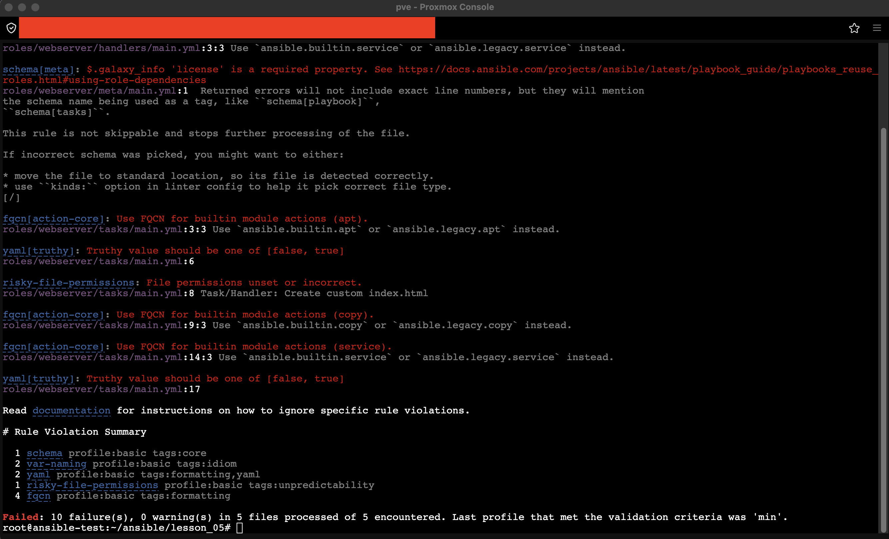
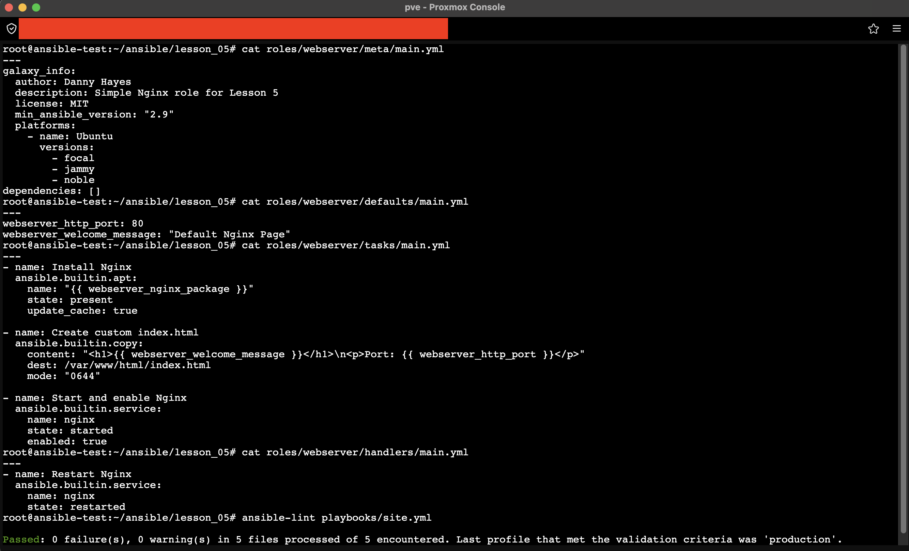

# Создание структуры проекта и работа с окружениями

## 1. Структура проекта

Создана стандартная структура Ansible-проекта с разделением на окружения `dev` и `prod` внутри `inventories/`, папками `playbooks/` и `roles/`.



> **Пункт 1:** Дерево папок `inventories/` с файлами `hosts` и `group_vars` для обоих окружений. Переменные `http_port` и `welcome_message` отличаются между окружениями: Dev использует порт `8080` и сообщение "Hello from DEV environment!", Prod — порт `80` и "Welcome to PRODUCTION environment."

## 2. Роль и плейбук

Создана роль `webserver` со стандартными подпапками (`tasks`, `defaults`, `handlers`, `templates`, `files`, `vars`, `meta`). Написан плейбук `playbooks/site.yml`, подключающий роль для группы хостов `webservers`.



> **Пункт 1-2:** Внутренняя структура роли, код задач (`tasks/main.yml`) и переменных по умолчанию (`defaults/main.yml`). Роль устанавливает Nginx, создаёт `index.html` с переменными окружения и запускает сервис.



> **Пункт 2:** Плейбук `site.yml` подключает роль `webserver` для группы `webservers` с escalation привилегий через `become: true`.

## 3. Применение для окружений

Плейбук запущен для каждого окружения с соответствующим файлом инвентори. Переменные окружения применяются автоматически через `group_vars`.

### Dev окружение
```bash
ansible-playbook -i inventories/dev/hosts playbooks/site.yml
```



> **Пункт 3:** Выполнение для `dev`. Применены переменные окружения: порт `8080`, сообщение "Hello from DEV environment!". Результат подтверждён через `curl`.

### Prod окружение
```bash
ansible-playbook -i inventories/prod/hosts playbooks/site.yml
```



> **Пункт 3:** Выполнение для `prod`. Переменные переопределены на продуктовые: порт `80`, сообщение "Welcome to PRODUCTION environment." Итоговое состояние хоста соответствует ожиданиям, идемпотентность соблюдена (`changed=0` при повторном запуске).

## 4. Линтинг

Установлен `ansible-lint`, выполнена проверка плейбука. Первоначально выявлено 10 нарушений.



> **Пункт 4:** Замечания линтера: отсутствие FQCN у модулей `apt`, `copy`, `service`; использование `yes`/`no` вместо булевых значений; отсутствие прав доступа у задачи `copy`; отсутствие поля `license` в `meta/main.yml`.

Все замечания изучены и устранены: модули переведены на `ansible.builtin.*`, значения приведены к `true`/`false`, добавлены `mode: "0644"` и `license: MIT`, переменные роли переименованы с префиксом `webserver_`.



> **Пункт 4:** После исправлений линтер не выдаёт критических ошибок: `Passed: 0 failure(s), 0 warning(s)` в 5 файлах. Достигнут профиль валидации `production`.

## Итог

Создан упорядоченный Ansible-проект с чёткой структурой папок и поддержкой окружений `dev` и `prod`. Плейбук корректно применяется для каждого окружения с разными переменными. Линтер не выдаёт критических ошибок, код соответствует профилю `production`.