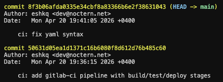
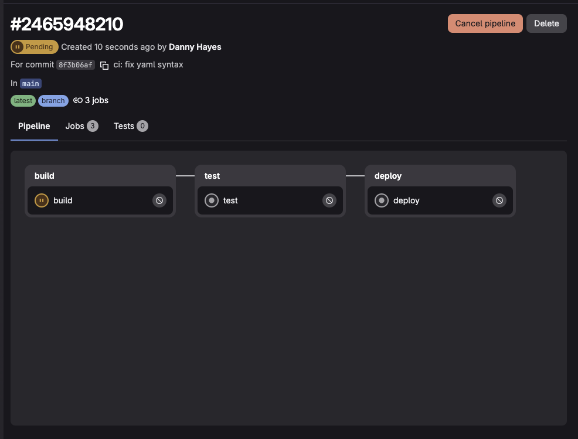
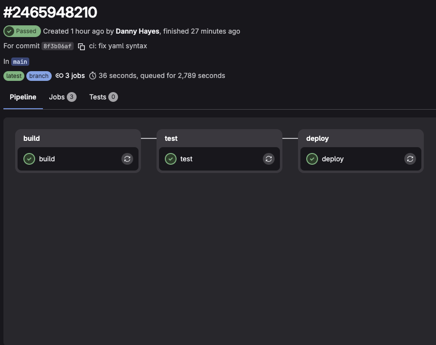
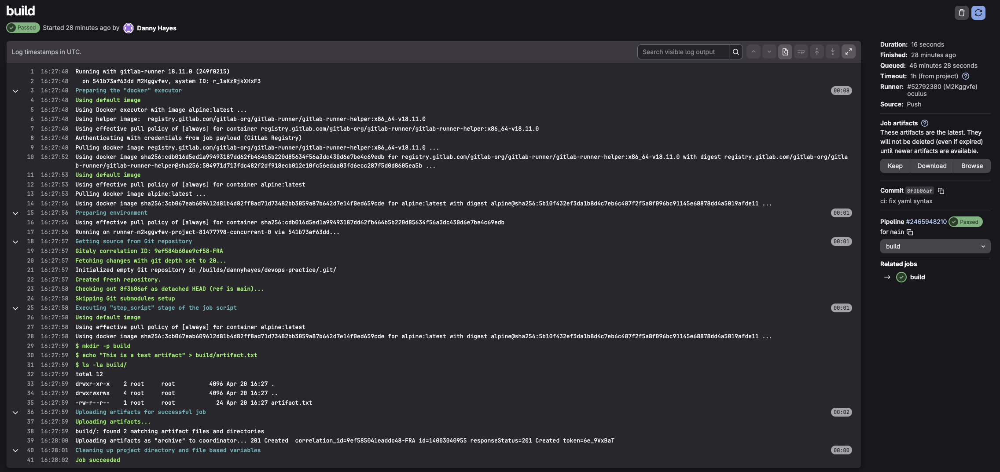
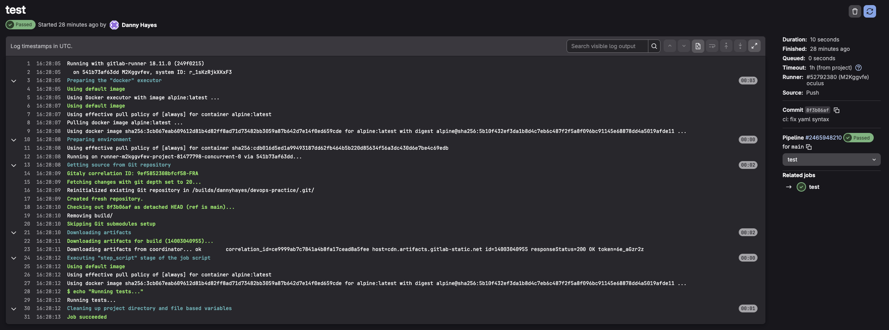

# Задание 1. Запуск и анализ GitLab CI/CD пайплайна

## 1. Добавление `.gitlab-ci.yml` в репозиторий

Использован ранее созданный репозиторий `devops-practice` на GitLab. В корень репозитория добавлен файл `.gitlab-ci.yml` со следующим содержимым:

```yaml
stages:
  - build
  - test
  - deploy

build:
  stage: build
  script:
    - mkdir -p build
    - echo "This is a test artifact" > build/artifact.txt
    - ls -la build/
  artifacts:
    paths:
      - build/

test:
  stage: test
  script:
    - echo "Running tests..."

deploy:
  stage: deploy
  script:
    - echo "Deploying the application..."
```

Изменения закоммичены и запушены в репозиторий:

```bash
git add .gitlab-ci.yml
git commit -m "ci: add gitlab-ci pipeline with build/test/deploy stages"
git push
```

### Скриншот коммита в репозитории



> **Пункт 1:** Файл `.gitlab-ci.yml` добавлен в репозиторий и запушен в ветку `main`.

---

## 2. Запуск пайплайна

После пуша GitLab автоматически обнаружил файл `.gitlab-ci.yml` и запустил пайплайн. Статус отслеживался в разделе **Build → Pipelines**.

Пайплайн оставался в статусе `Pending` около 40 минут - shared runners GitLab не подхватывали задачу. Для решения проблемы был зарегистрирован собственный GitLab Runner через Docker:

```yaml
services:
  gitlab-runner:
    image: gitlab/gitlab-runner:latest
    restart: always
    volumes:
      - ./config:/etc/gitlab-runner
      - /var/run/docker.sock:/var/run/docker.sock
```

Раннер зарегистрирован в GitLab:

```bash
docker compose exec gitlab-runner gitlab-runner register \
  --url https://gitlab.com \
  --token <токен> \
  --executor docker \
  --docker-image alpine:latest \
  --non-interactive
```

После регистрации раннер подхватил пайплайн и выполнение началось.


### Скриншот запущенного пайплайна



> **Пункт 2:** Пайплайн запущен после подключения собственного раннера. Видны три стадии: `build`, `test`, `deploy`.

---

## 3. Завершение всех стадий и логи

Дождались завершения всех стадий пайплайна. Все три джоба выполнены со статусом **Passed**.

### Скриншот завершённого пайплайна



### Скриншот логов стадии build



### Скриншот логов стадии test



### Скриншот логов стадии deploy


> **Пункты 3–4:** Все стадии завершены успешно. Логи каждого шага подтверждают корректное выполнение скриптов.

---

## Конечный результат

- ✅ **Файл `.gitlab-ci.yml` добавлен** в репозиторий `devops-practice`.
- ✅ **Собственный GitLab Runner развёрнут** через Docker для решения проблемы с очередью shared runners.
- ✅ **Пайплайн запущен автоматически** после пуша в ветку `main`.
- ✅ **Все три стадии пройдены:** `build`, `test`, `deploy` — статус Passed.