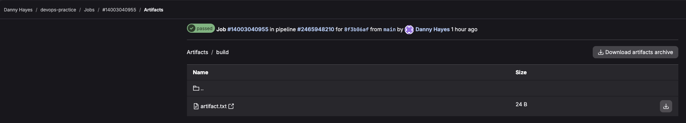
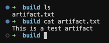

# Задание 2. Проверка артефактов

## 1. Переход в раздел Build → Jobs

После успешного завершения пайплайна выполнен переход в раздел **Build → Jobs** для просмотра выполненных джобов.

### Скриншот раздела Jobs

> **Пункт 1:** В разделе Jobs отображены все три выполненных джоба со статусом Passed.

---

## 2. Открытие последнего build-джоба

Открыт успешно выполненный джоб `build` для просмотра деталей и артефактов.

### Скриншот страницы build-джоба

> **Пункт 2:** Страница джоба `build` с логами выполнения и разделом Artifacts.

---

## 3. Скачивание артефакта

В разделе **Artifacts** на странице джоба найден и скачан созданный артефакт.

### Скриншот раздела Artifacts

> **Пункт 3:** Раздел Artifacts содержит файл `build/artifact.txt`, доступный для скачивания.

---

## 4. Проверка содержимого артефакта

Загруженный архив распакован. В нём обнаружен файл `artifact.txt` с ожидаемым содержимым.

### Скриншот распакованного архива и содержимого файла

> **Пункты 4–5:** Файл `artifact.txt` содержит текст `This is a test artifact`, что подтверждает корректную работу стадии `build`.

---

## Конечный результат

- ✅ **Пайплайн успешно выполнен:** все три стадии пройдены со статусом Passed.
- ✅ **Артефакт сформирован:** файл `build/artifact.txt` создан в стадии `build`.
- ✅ **Содержимое проверено:** файл содержит текст `This is a test artifact`.