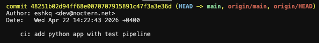
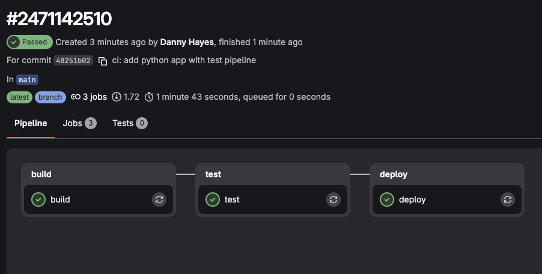
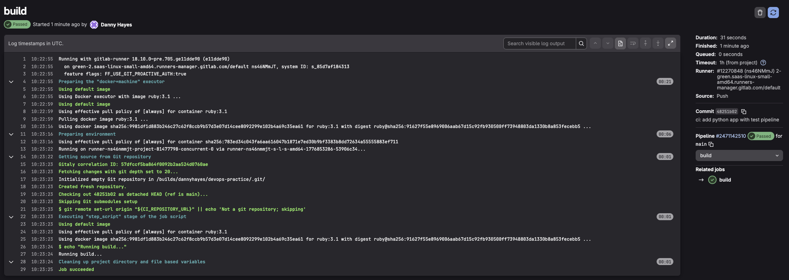
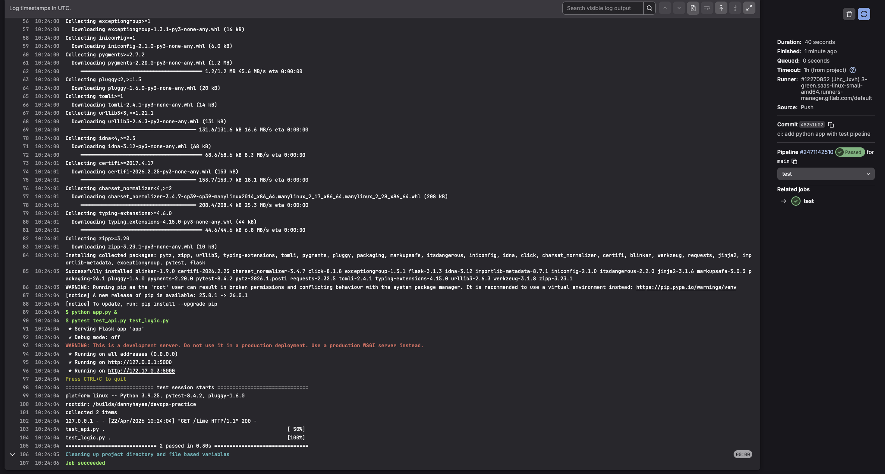
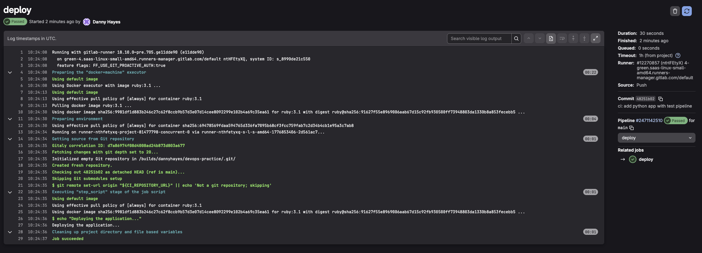

# Задание 1. Настройка CI/CD пайплайна

## 1. Добавление файлов приложения в репозиторий

В репозиторий `devops-practice` добавлены следующие файлы:

- `app.py` — Flask-сервис с эндпоинтом `/time`, возвращающим текущее время
- `requirements.txt` — зависимости: flask, pytz, pytest, requests
- `test_api.py` — тест API (GET `/time`, проверка статуса и наличия поля `current_time`)
- `test_logic.py` — тест бизнес-логики (проверка формата времени)

Настроен `.gitlab-ci.yml` со следующей конфигурацией:

```yaml
stages:
  - build
  - test
  - deploy

build:
  stage: build
  script:
    - echo "Running build..."

test:
  stage: test
  image: python:3.9
  script:
    - pip install -r requirements.txt
    - python app.py &
    - pytest test_api.py test_logic.py

deploy:
  stage: deploy
  script:
    - echo "Deploying the application..."
```

Изменения закоммичены и запушены:

```bash
git add .
git commit -m "ci: add python app with test pipeline"
git push
```

### Скриншот коммита



> **Пункт 1:** Файлы приложения и `.gitlab-ci.yml` добавлены в репозиторий.

---

## 2. Выполнение пайплайна

После пуша GitLab запустил пайплайн. Все три стадии выполнены со статусом **Passed**.

### Скриншот завершённого пайплайна



> **Пункт 4:** Пайплайн успешно выполнен, все три стадии пройдены.

---

## 3. Логи выполнения стадий

### Build



> **Пункт 2:** Build-job выполняет роль заглушки — выводит `Running build...`.

### Test



> **Пункт 3:** Test-job использует образ `python:3.9`. Установлены зависимости из `requirements.txt`, запущен Flask-сервер (`python app.py &`), выполнены тесты. Результат: `2 passed in 0.38s`.

### Deploy



> **Пункт 3:** Deploy-job выполняет роль заглушки — выводит `Deploying the application...`.

---

## Конечный результат

- ✅ **Файлы приложения добавлены:** `app.py`, `requirements.txt`, `test_api.py`, `test_logic.py`.
- ✅ **Пайплайн настроен** с тремя стадиями: build, test, deploy.
- ✅ **Тесты пройдены:** `2 passed` — API и бизнес-логика работают корректно.
- ✅ **Build и deploy** реализованы как заглушки.