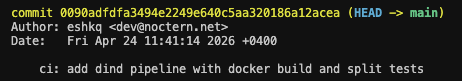
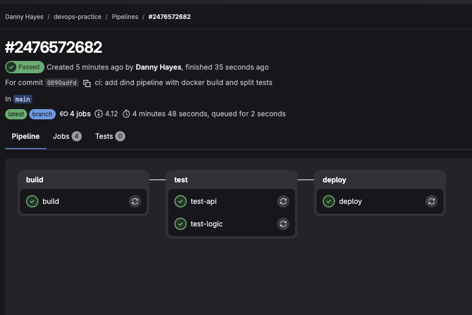
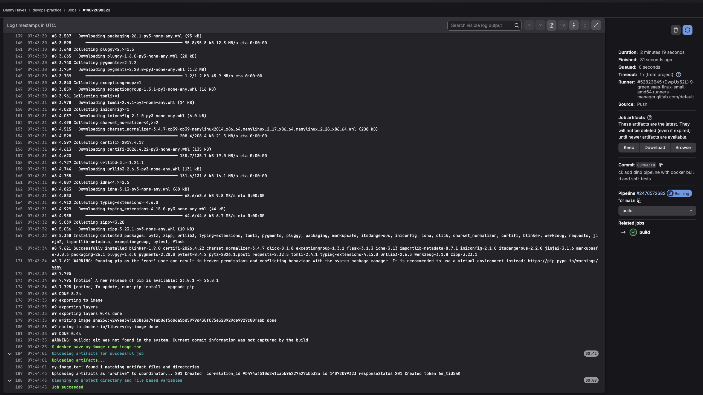
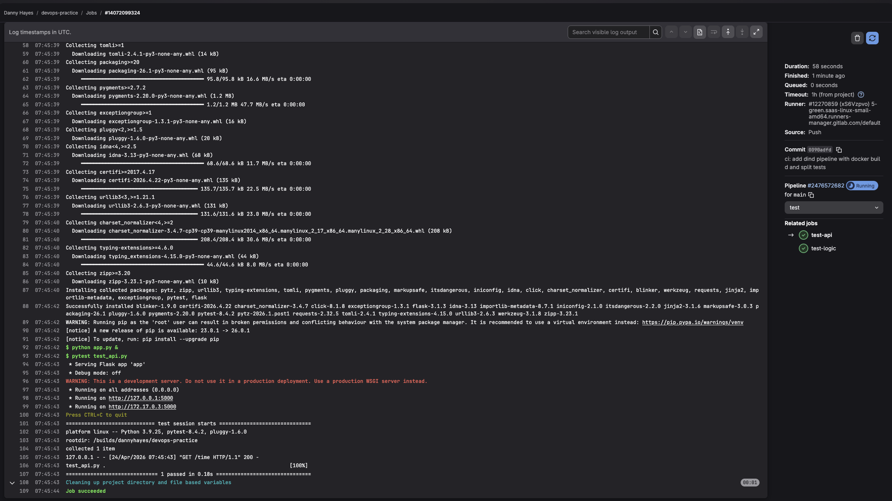
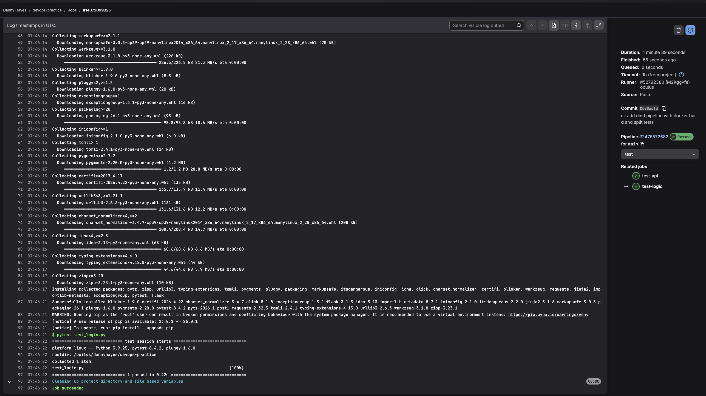
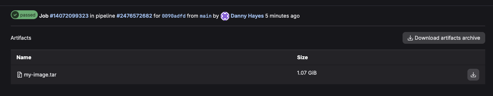

# Задание 3. Запускаем DinD-пайплайн и разбираем логи

## 1. Добавление файлов в репозиторий

В репозиторий добавлен `Dockerfile` для контейнеризации Flask-приложения из предыдущей практики:

```dockerfile
FROM python:3.9
WORKDIR /app
COPY . .
RUN pip install -r requirements.txt
CMD ["python", "app.py"]
```

Также добавлен `.gitlab-ci.yml` со следующей конфигурацией:

```yaml
stages:
  - build
  - test
  - deploy

build:
  stage: build
  image: docker:24.0.5
  services:
    - docker:24.0.5-dind
  script:
    - docker build -t my-image .
    - docker save my-image > my-image.tar
  artifacts:
    paths:
      - my-image.tar

test-api:
  stage: test
  image: python:3.9
  script:
    - pip install -r requirements.txt
    - python app.py &
    - pytest test_api.py

test-logic:
  stage: test
  image: python:3.9
  script:
    - pip install -r requirements.txt
    - pytest test_logic.py

deploy:
  stage: deploy
  script:
    - echo "Deploying the application..."
```

Изменения закоммичены и запушены:

```bash
git add .
git commit -m "ci: add dind pipeline with docker build and split tests"
git push
```

### Скриншот коммита



> **Пункт 1:** Dockerfile и `.gitlab-ci.yml` добавлены в репозиторий.

---

## 2. Выполнение пайплайна

После пуша запустился пайплайн с 4 джобами: `build`, `test-api`, `test-logic`, `deploy`. Все выполнены со статусом **Passed**.

### Скриншот завершённого пайплайна



> **Пункты 2–3:** Пайплайн успешно выполнен. В стадии `test` два параллельных джоба — `test-api` и `test-logic`.

---

## 3. Логи выполнения стадий

### Build — сборка Docker-образа через DinD



> **Пункт 3:** В логах видно запуск сервиса `docker:24.0.5-dind`, сборку образа командой `docker build`, сохранение в `my-image.tar` командой `docker save`. Артефакт размером 1.07 GiB успешно загружен в GitLab.

### Test-API



> **Пункт 4:** Flask-сервер запущен в фоне (`python app.py &`), выполнен тест `test_api.py`. Результат: `1 passed in 0.18s`.

### Test-Logic



> **Пункт 4:** Выполнен тест `test_logic.py`. Результат: `1 passed in 0.22s`.

---

## 4. Артефакт сборки

### Скриншот артефакта



> **Пункт 3:** Артефакт `my-image.tar` (1.07 GiB) доступен для скачивания в разделе Artifacts джоба `build`.

---

## Конечный результат

- ✅ **Dockerfile добавлен** для контейнеризации Flask-приложения.
- ✅ **DinD-пайплайн настроен:** образ собран через `docker:24.0.5-dind`, сохранён как артефакт.
- ✅ **Тесты разделены на два стейджа:** `test-api` и `test-logic` — оба прошли успешно.
- ✅ **Все 4 джоба выполнены** со статусом Passed.