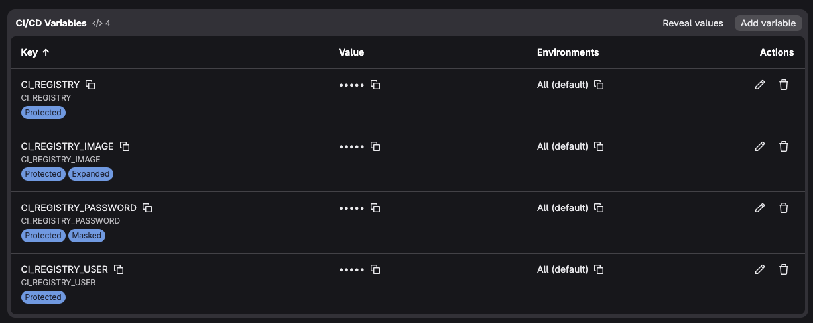
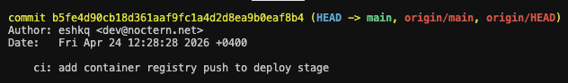
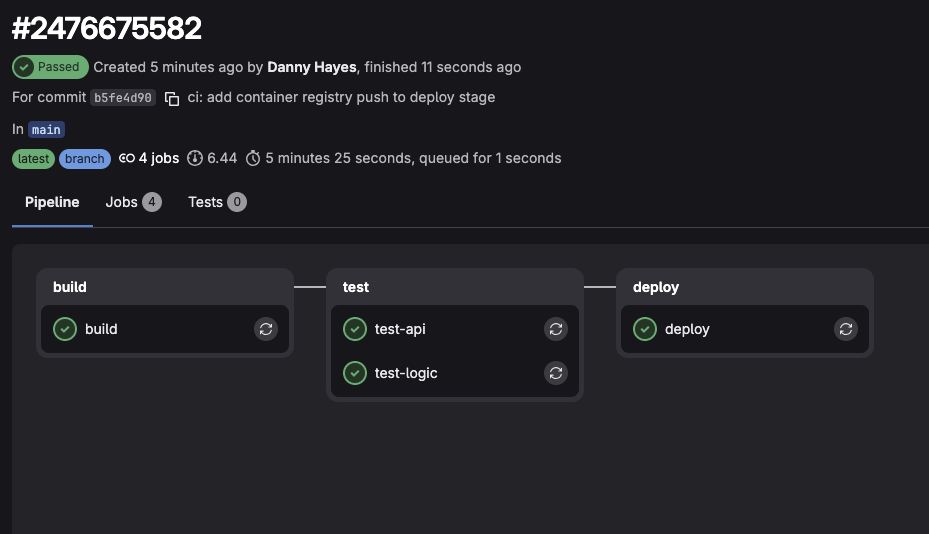
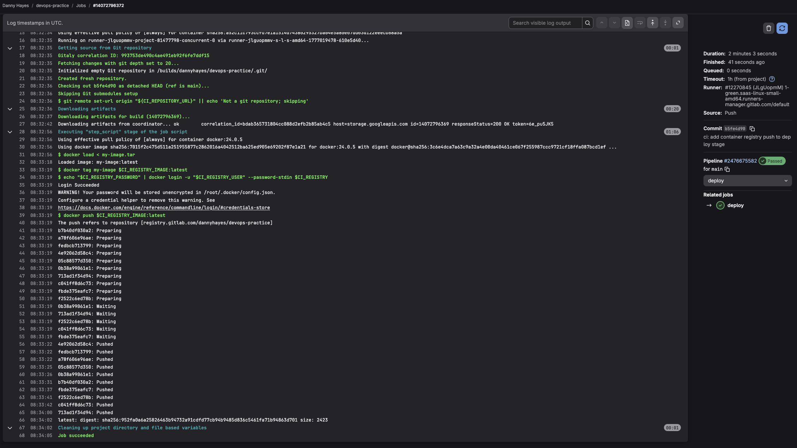
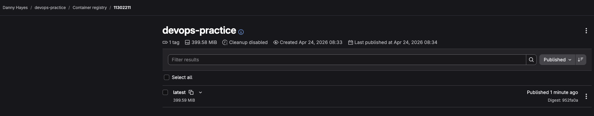

# Задание 1. Загружаем образ в GitLab Container Registry

## 1. Проверка доступности Container Registry

Раздел **Deploy → Container Registry** доступен в проекте `devops-practice`.

---

## 2. Создание Personal Access Token

Создан Legacy PAT с правами `read_registry` и `write_registry` через **User Settings → Access Tokens → Generate token → Legacy token**.

---

## 3. Настройка переменных CI/CD

В **Settings → CI/CD → Variables** добавлены четыре переменные:

| Переменная | Значение | Флаги |
|---|---|---|
| `CI_REGISTRY` | `registry.gitlab.com` | Protected |
| `CI_REGISTRY_IMAGE` | `registry.gitlab.com/$CI_PROJECT_PATH` | Protected, Expanded |
| `CI_REGISTRY_USER` | GitLab username | Protected |
| `CI_REGISTRY_PASSWORD` | PAT токен | Protected, Masked |

### Скриншот переменных



> **Пункт 3:** Все четыре переменные добавлены в Settings → CI/CD → Variables.

---

## 4. Deploy-джоб — публикация образа в Registry

В `.gitlab-ci.yml` добавлен deploy-джоб, который загружает артефакт сборки, тегирует образ и публикует его в GitLab Container Registry. Джоб выполняется только на ветке `main`.

```yaml
deploy:
  stage: deploy
  image: docker:24.0.5
  services:
    - docker:24.0.5-dind
  script:
    - docker load < my-image.tar
    - docker tag my-image $CI_REGISTRY_IMAGE:latest
    - echo "$CI_REGISTRY_PASSWORD" | docker login -u "$CI_REGISTRY_USER" --password-stdin $CI_REGISTRY
    - docker push $CI_REGISTRY_IMAGE:latest
  only:
    - main
```

Изменения закоммичены и запушены:

```bash
git commit -m "ci: add container registry push to deploy stage"
git push
```

### Скриншот коммита



### Скриншот завершённого пайплайна



### Скриншот логов deploy-джоба



> **Пункт 4:** В логах видно успешную аутентификацию (`Login Succeeded`), загрузку артефакта (`docker load`), тегирование и пуш всех слоёв образа в Registry.

### Скриншот Container Registry



> **Конечный результат:** Образ `latest` (399.59 MiB) опубликован в GitLab Container Registry.

---

## Конечный результат

- ✅ **PAT создан** с правами `read_registry` и `write_registry`.
- ✅ **Переменные CI/CD настроены:** `CI_REGISTRY`, `CI_REGISTRY_IMAGE`, `CI_REGISTRY_USER`, `CI_REGISTRY_PASSWORD`.
- ✅ **Deploy-джоб добавлен:** образ публикуется в Registry автоматически при пуше в `main`.
- ✅ **Образ доступен** в GitLab Container Registry с тегом `latest`.