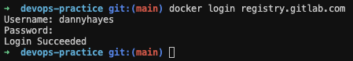
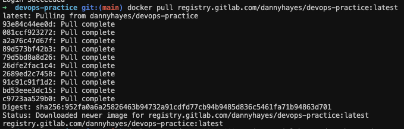
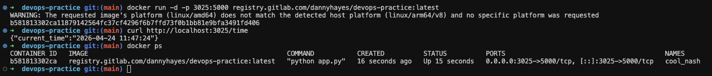

# Задание 2. Локальное развертывание контейнера

## 1. Авторизация в GitLab Container Registry

```bash
docker login registry.gitlab.com
```

### Скриншот авторизации



> **Пункт 2:** Успешная авторизация в GitLab Container Registry.

---

## 2. Получение образа из Registry

```bash
docker pull registry.gitlab.com/dannyhayes/devops-practice:latest
```

### Скриншот загрузки образа



> **Пункт 3:** Образ успешно загружен из GitLab Container Registry.

---

## 3. Запуск контейнера и проверка API

```bash
docker run -d -p 3025:5000 registry.gitlab.com/dannyhayes/devops-practice:latest
curl http://localhost:3025/time
```

Порт 5000 был занят на локальной машине, поэтому использован маппинг `3025:5000`.

### Скриншот запуска и проверки API



> **Пункты 4–5:** Контейнер запущен (`Up 15 seconds`), API отвечает: `{"current_time":"2026-04-24 11:47:24"}`.

---

## Конечный результат

- ✅ **Авторизация выполнена** в GitLab Container Registry.
- ✅ **Образ загружен** из Registry (`registry.gitlab.com/dannyhayes/devops-practice:latest`).
- ✅ **Контейнер запущен**, API `/time` возвращает корректный ответ.