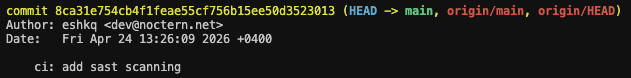
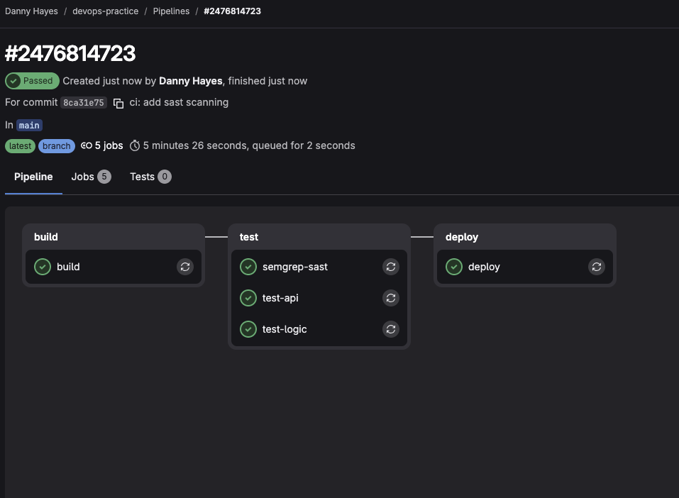
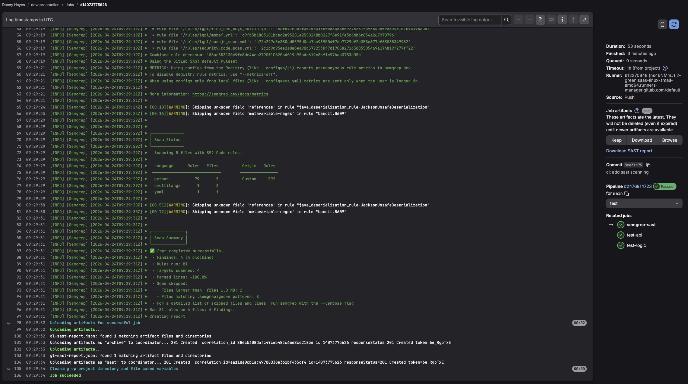
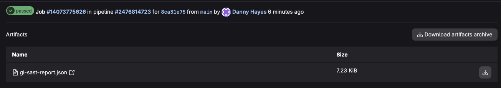
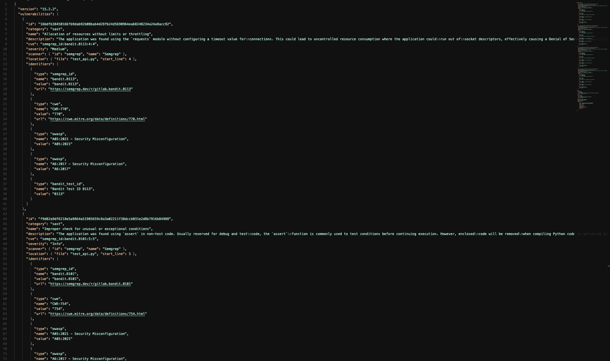
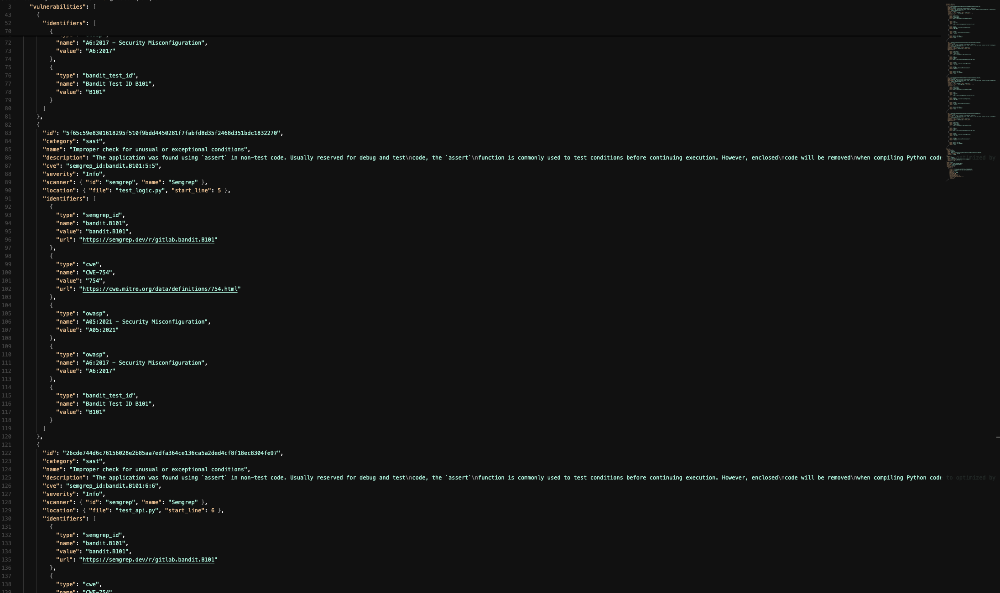
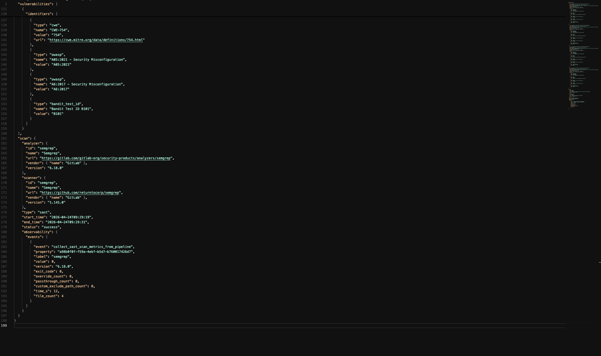

# Задание 1. Настраиваем SAST-сканирование в GitLab CI/CD

## 1. Включение SAST в `.gitlab-ci.yml`

В существующий `.gitlab-ci.yml` добавлено подключение шаблона GitLab SAST:

```yaml
include:
  - template: Jobs/SAST.gitlab-ci.yml
```

Шаблон автоматически добавляет джоб `semgrep-sast` в стадию `test`, параллельно с остальными тестами.

Изменения закоммичены и запушены:

```bash
git commit -m "ci: add sast scanning"
git push
```

### Скриншот коммита



---

## 2. Выполнение пайплайна

### Скриншот завершённого пайплайна



> **Пункты 2–3:** После пуша пайплайн запустился автоматически. Джоб `semgrep-sast` выполнился в стадии `test`.

---

## 3. Логи SAST-джоба

### Скриншот логов



> **Пункт 3:** Semgrep выполнил сканирование 4 файлов за 12 секунд.

---

## 4. Артефакт отчёта

### Скриншот артефакта



> **Пункт 4:** Файл `gl-sast-report.json` доступен в разделе Build → Artifacts джоба `semgrep-sast`.

---

## 5. Анализ отчёта

### Скриншоты отчёта







> **Пункт 5:** Отчёт содержит 4 уязвимости, найденные Semgrep (bandit rules).

### Результаты сканирования

Сканер: **Semgrep 1.145.0**, проверено 4 файла.

**1 уязвимость Medium — B113 (`test_api.py:4`)**

`requests.get()` вызван без параметра `timeout`. Неограниченное ожидание ответа может привести к исчерпанию сокетов и DoS. Фикс: добавить `timeout=10` в вызов.

**3 уязвимости Info — B101 (`test_api.py:5,6`, `test_logic.py:5`)**

Использование `assert` в коде. Semgrep помечает `assert` как потенциальную проблему, поскольку в оптимизированном байткоде Python эти проверки удаляются. В данном случае это **false positive** — файлы являются тестовыми, использование `assert` в тестах является стандартной практикой.

---

## Конечный результат

- ✅ **SAST подключён** через шаблон `Jobs/SAST.gitlab-ci.yml`.
- ✅ **Сканирование запускается автоматически** при каждом коммите в стадии `test`.
- ✅ **Отчёт `gl-sast-report.json`** доступен в артефактах.
- ✅ **Найдено 4 уязвимости:** 1 Medium (отсутствие timeout в requests), 3 Info (использование assert в тестах — false positive).